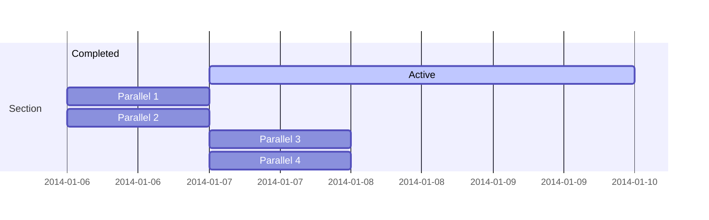

# skyflow_backbend
skyflow is a workflow based on AWS  Amazon States Language (ASL)


# repository code struct
代码结构
```
+ proto             // api proto file defintion
+ gen               // protoc generate code
    |- pb           // generated protobuf files. *.pb.go
    |- apidoc       // generated api doc files . swagger.json / openapi.json
+ docs              // docs for this repository
+ schemas           // schemas for statemachine language
+ cmd               // build command defintion
    |- skyflow      // skyflow server
    |- skyflowcli   // skyflow cli
+ config            // config struct defintion
+ workflow          // main service part for workflow
    |- parser       // statemachine parser
    |- executor     // execution executor
    |- tempate      // template management
+ server            // server defintion
    |- apiserver    // api server
    |- dispatcher   // dispatcher server
+ examples          // example test file
```

调用流程图

